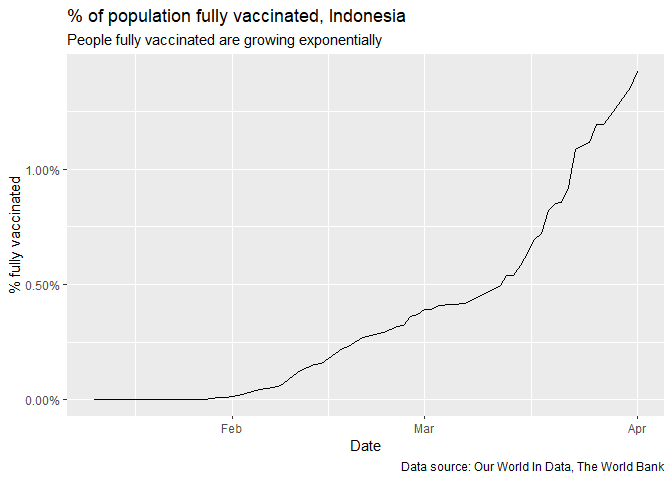

Basic R Math
================
Aviandito, edited by Yurham Afif
4/20/2021

## Load Packages

This is the code chunk to load `tidyverse`

``` r
library(tidyverse)
```

    ## Warning: package 'tidyverse' was built under R version 4.0.5

    ## -- Attaching packages --------------------------------------- tidyverse 1.3.1 --

    ## v ggplot2 3.3.3     v purrr   0.3.4
    ## v tibble  3.1.0     v dplyr   1.0.5
    ## v tidyr   1.1.3     v stringr 1.4.0
    ## v readr   1.4.0     v forcats 0.5.1

    ## Warning: package 'tidyr' was built under R version 4.0.5

    ## Warning: package 'readr' was built under R version 4.0.5

    ## Warning: package 'dplyr' was built under R version 4.0.5

    ## -- Conflicts ------------------------------------------ tidyverse_conflicts() --
    ## x dplyr::filter() masks stats::filter()
    ## x dplyr::lag()    masks stats::lag()

## Read data

This is the code chunk to load `Indonesia.csv`

``` r
indonesia <- read_csv('Indonesia.csv')
```

    ## 
    ## -- Column specification --------------------------------------------------------
    ## cols(
    ##   location = col_character(),
    ##   date = col_date(format = ""),
    ##   vaccine = col_character(),
    ##   source_url = col_character(),
    ##   total_vaccinations = col_double(),
    ##   people_vaccinated = col_double(),
    ##   people_fully_vaccinated = col_double()
    ## )

After reading data, you might want to have a quick look on the columns.
You can use `glimpse()`

``` r
glimpse(indonesia)
```

    ## Rows: 59
    ## Columns: 7
    ## $ location                <chr> "Indonesia", "Indonesia", "Indonesia", "Indone~
    ## $ date                    <date> 2021-01-12, 2021-01-22, 2021-01-24, 2021-01-2~
    ## $ vaccine                 <chr> "Sinovac", "Sinovac", "Sinovac", "Sinovac", "S~
    ## $ source_url              <chr> "https://www.dw.com/en/indonesias-covid-vaccin~
    ## $ total_vaccinations      <dbl> 0, 132000, 149242, 161959, 245685, 308003, 373~
    ## $ people_vaccinated       <dbl> 0, 132000, 149242, 161959, 245685, 308003, 368~
    ## $ people_fully_vaccinated <dbl> 0, 0, 0, 0, 0, 0, 5468, 11287, 20810, 22548, 3~

Your turn! RStudio came with a built-in dataset called `mpg`. Now please
create a new code chunk to run `glimpse(mpg)`!

``` r
glimpse(mpg)
```

    ## Rows: 234
    ## Columns: 11
    ## $ manufacturer <chr> "audi", "audi", "audi", "audi", "audi", "audi", "audi", "~
    ## $ model        <chr> "a4", "a4", "a4", "a4", "a4", "a4", "a4", "a4 quattro", "~
    ## $ displ        <dbl> 1.8, 1.8, 2.0, 2.0, 2.8, 2.8, 3.1, 1.8, 1.8, 2.0, 2.0, 2.~
    ## $ year         <int> 1999, 1999, 2008, 2008, 1999, 1999, 2008, 1999, 1999, 200~
    ## $ cyl          <int> 4, 4, 4, 4, 6, 6, 6, 4, 4, 4, 4, 6, 6, 6, 6, 6, 6, 8, 8, ~
    ## $ trans        <chr> "auto(l5)", "manual(m5)", "manual(m6)", "auto(av)", "auto~
    ## $ drv          <chr> "f", "f", "f", "f", "f", "f", "f", "4", "4", "4", "4", "4~
    ## $ cty          <int> 18, 21, 20, 21, 16, 18, 18, 18, 16, 20, 19, 15, 17, 17, 1~
    ## $ hwy          <int> 29, 29, 31, 30, 26, 26, 27, 26, 25, 28, 27, 25, 25, 25, 2~
    ## $ fl           <chr> "p", "p", "p", "p", "p", "p", "p", "p", "p", "p", "p", "p~
    ## $ class        <chr> "compact", "compact", "compact", "compact", "compact", "c~

## R Basics

### Declaring & putting a value into a variable

You can declare and put a value into a variable with `<-`

``` r
a <- 5
b <- 8
```

### Basic mathematical operations

Basic mathematical expressions are similar with other languages

``` r
addition <- a + b
substraction <- a - b
multiplication <- a * b
division <- a / b
modulo <- a %% b

paste0("Result of addition: ", addition,
      ", result of substraction: ", substraction,
      ", result of multiplication: ", multiplication,
      ", result of division: ", division,
      ", result of modulo: ", modulo)
```

    ## [1] "Result of addition: 13, result of substraction: -3, result of multiplication: 40, result of division: 0.625, result of modulo: 5"

### Declaring a function

You can declare a function with `function()`. Put the function argument
in the brackets `()`. Enclose your code for the function with curly
brackets `{}`

``` r
a_plus_b <- function(a, b){
  a + b
}

c <- a_plus_b(a=21, b=22)

c
```

    ## [1] 43

### Looping

Similar with other language, you can iterate through a list in R with
`for` loop or `while` loop

For loop

``` r
# command to declare a list
list_to_iterate <- c(12, 13, 14)

for (i in list_to_iterate){
  c <- a_plus_b(20, i)
  print(c)
}
```

    ## [1] 32
    ## [1] 33
    ## [1] 34

While loop

``` r
i = 1
while (i <= 3){
  c <- a_plus_b(20, list_to_iterate[i])
  print(c)
  i = i+1
}
```

    ## [1] 32
    ## [1] 33
    ## [1] 34

### Basic wrangling & plotting in `tidyverse`

Below is a plot of % population fully vaccinated in Indonesia.
Vaccination data is from Our World in Data, and 2019 population data is
from The World Bank.

Your task: the code for new column `pct_fully_vaccinated` is incomplete.
Please complete it with the proper calculation, which is
`people_fully_vaccinated` column divided by `indo_pop_2019` variable
that we declared.

``` r
# 2019 Indonesia population from https://data.worldbank.org/indicator/SP.POP.TOTL?locations=ID
indo_pop_2019 <- 270625568

# Create a new column which shows the % of population fully vaccinated
indonesia %>%
  # TASK: Complete the code for pct_fully_vaccinated column, which is people_fully_vaccinated divided by indo_pop_2019
  mutate(pct_fully_vaccinated = people_fully_vaccinated / indo_pop_2019) %>%
  ggplot(aes(x = date, y = pct_fully_vaccinated)) +
  geom_line() +
  scale_y_continuous(labels = scales::percent) +
  labs(title = '% of population fully vaccinated, Indonesia',
       subtitle = 'People fully vaccinated are growing exponentially',
       x = 'Date',
       y = '% fully vaccinated',
       caption = 'Data source: Our World In Data, The World Bank')
```

<!-- -->
