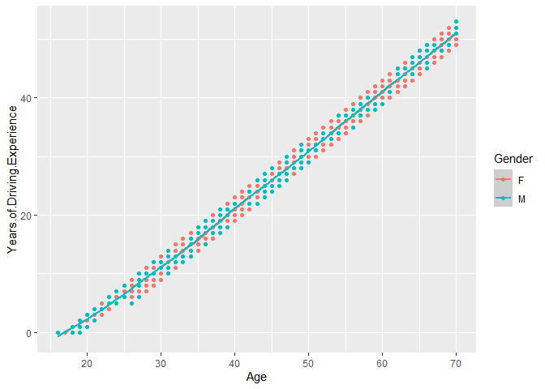

Data Visualization with R
================
Yurham Afif
5/24/2021

## Load Packages

This is the code chunk to load `tidyverse`

``` r
library(tidyverse)
```

    ## Warning: package 'tidyverse' was built under R version 4.0.5

    ## -- Attaching packages --------------------------------------- tidyverse 1.3.1 --

    ## v ggplot2 3.3.3     v purrr   0.3.4
    ## v tibble  3.1.0     v dplyr   1.0.5
    ## v tidyr   1.1.3     v stringr 1.4.0
    ## v readr   1.4.0     v forcats 0.5.1

    ## Warning: package 'tidyr' was built under R version 4.0.5

    ## Warning: package 'readr' was built under R version 4.0.5

    ## Warning: package 'dplyr' was built under R version 4.0.5

    ## -- Conflicts ------------------------------------------ tidyverse_conflicts() --
    ## x dplyr::filter() masks stats::filter()
    ## x dplyr::lag()    masks stats::lag()

## Read data

This is the code chunk to load `Insurance_Loss (1).csv`

``` r
insurance <- read.csv('Insurance_Loss (1).csv')
```

## summarise the data

see the data overview

``` r
insurance %>% 
  summary()
```

    ##  Policy.Number         Age        Years.of.Driving.Experience
    ##  Min.   :100002   Min.   :16.00   Min.   : 0.00              
    ##  1st Qu.:124901   1st Qu.:24.00   1st Qu.: 6.00              
    ##  Median :149898   Median :42.00   Median :23.00              
    ##  Mean   :149962   Mean   :42.33   Mean   :23.73              
    ##  3rd Qu.:175020   3rd Qu.:61.00   3rd Qu.:42.00              
    ##  Max.   :200454   Max.   :70.00   Max.   :53.00              
    ##  Number.of.Vehicles    Gender            Married           Vehicle.Age    
    ##  Min.   :1.000      Length:15290       Length:15290       Min.   : 0.000  
    ##  1st Qu.:2.000      Class :character   Class :character   1st Qu.: 6.000  
    ##  Median :2.000      Mode  :character   Mode  :character   Median : 9.000  
    ##  Mean   :2.496                                            Mean   : 8.656  
    ##  3rd Qu.:3.000                                            3rd Qu.:12.000  
    ##  Max.   :4.000                                            Max.   :15.000  
    ##   Fuel.Type             Losses       
    ##  Length:15290       Min.   :  12.54  
    ##  Class :character   1st Qu.: 226.43  
    ##  Mode  :character   Median : 354.94  
    ##                     Mean   : 389.86  
    ##                     3rd Qu.: 488.68  
    ##                     Max.   :3500.00

``` r
insurance %>% 
  glimpse()
```

    ## Rows: 15,290
    ## Columns: 9
    ## $ Policy.Number               <int> 150024, 144880, 133742, 151282, 174407, 14~
    ## $ Age                         <int> 24, 31, 56, 52, 20, 29, 36, 67, 69, 16, 19~
    ## $ Years.of.Driving.Experience <int> 5, 10, 37, 31, 3, 8, 19, 49, 48, 0, 1, 8, ~
    ## $ Number.of.Vehicles          <int> 1, 1, 1, 1, 1, 1, 1, 1, 1, 1, 1, 1, 1, 1, ~
    ## $ Gender                      <chr> "M", "F", "M", "F", "M", "M", "F", "F", "M~
    ## $ Married                     <chr> "Married", "Single", "Married", "Married",~
    ## $ Vehicle.Age                 <int> 11, 6, 0, 15, 15, 9, 0, 15, 5, 14, 12, 14,~
    ## $ Fuel.Type                   <chr> "P", "P", "D", "P", "P", "P", "P", "P", "P~
    ## $ Losses                      <dbl> 203.31959, 402.19730, 553.13210, 292.43058~

## check missing data

sum of total NA data

``` r
insurance %>% 
  is.na() %>% 
  sum()
```

    ## [1] 0

## ggplot geom\_point geom\_smooth `Age` x `Years.of.Driving.Experience`

this graph shows an almost linear relation between `Age` and
`Years.of.Driving.Experience`. The higher age, the higher driving
experience.

``` r
ggplot(data = insurance, aes(x = Age, y = Years.of.Driving.Experience, colour = Gender)) + 
  geom_point() +
  geom_smooth()
```

    ## `geom_smooth()` using method = 'gam' and formula 'y ~ s(x, bs = "cs")'

<!-- -->

## ggplot geom\_point `Years.of.Driving.Experience` x `Losses` with `Gender` factor

The less driving experience, the higher losses they got, and visually
dominated by male driver.

``` r
ggplot(data = insurance, aes(x = Years.of.Driving.Experience, y = Losses)) +
  geom_point(aes(colour = Gender))
```

<!-- -->

## ggplot geom\_point `Years.of.Driving.Experience` x `Losses` with `Married` factor

Single driver make lots of losses despite of their driving experience.

``` r
ggplot(data = insurance, aes(x = Years.of.Driving.Experience, y = Losses)) +
  geom_point(aes(colour = Married))
```

<!-- -->

## ggplot geom\_col `Fuel.Type` x `Losses`

the fuel type `D` has higher losses compared to type `P`

``` r
ggplot(data = insurance, aes(x = Fuel.Type, y = Losses, colour = Fuel.Type)) +
  geom_col()
```

<!-- -->

## ggplot geom\_boxplot `Gender` x `Age`

this graph implies that both ‘Female’ and ‘male’ have the same
distribution number of owned vehicles with median 2

``` r
ggplot(data = insurance, aes(x = Gender, y = Age)) + 
  geom_boxplot(aes(colour = Gender))
```

<!-- -->
