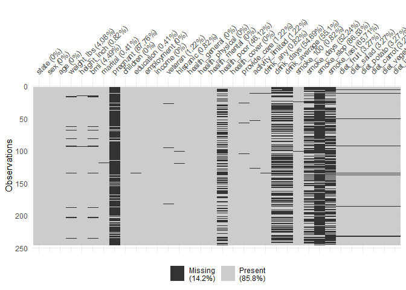
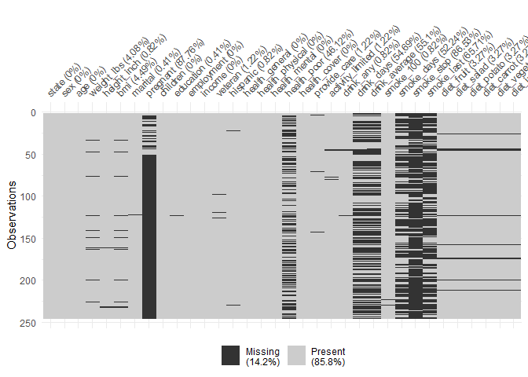
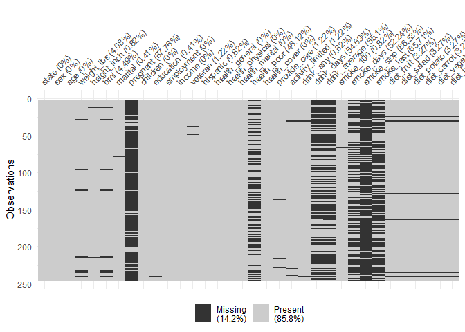

Homework R in Practice
================
Calvin Sibarani, edited by Yurham Afif
5/17/2021

``` r
# Install the package if you haven't!
# install.packages('naniar')
library(naniar)
```

    ## Warning: package 'naniar' was built under R version 4.0.5

``` r
library(tidyverse)
```

    ## Warning: package 'tidyverse' was built under R version 4.0.5

    ## -- Attaching packages --------------------------------------- tidyverse 1.3.1 --

    ## v ggplot2 3.3.3     v purrr   0.3.4
    ## v tibble  3.1.0     v dplyr   1.0.5
    ## v tidyr   1.1.3     v stringr 1.4.0
    ## v readr   1.4.0     v forcats 0.5.1

    ## Warning: package 'tidyr' was built under R version 4.0.5

    ## Warning: package 'readr' was built under R version 4.0.5

    ## Warning: package 'dplyr' was built under R version 4.0.5

    ## -- Conflicts ------------------------------------------ tidyverse_conflicts() --
    ## x dplyr::filter() masks stats::filter()
    ## x dplyr::lag()    masks stats::lag()

``` r
riskfactors
```

    ## # A tibble: 245 x 34
    ##    state sex      age weight_lbs height_inch   bmi marital     pregnant children
    ##    <fct> <fct>  <int>      <int>       <int> <dbl> <fct>       <fct>       <int>
    ##  1 26    Female    49        190          64  32.7 Married     <NA>            0
    ##  2 40    Female    48        170          68  25.9 Divorced    <NA>            0
    ##  3 72    Female    55        163          64  28.0 Married     <NA>            0
    ##  4 42    Male      42        230          74  29.6 Married     <NA>            1
    ##  5 32    Female    66        135          62  24.7 Widowed     <NA>            0
    ##  6 19    Male      66        165          70  23.7 Married     <NA>            0
    ##  7 45    Male      37        150          68  22.9 Married     <NA>            3
    ##  8 56    Female    62        170          70  24.4 NeverMarri~ <NA>            0
    ##  9 18    Male      38        146          70  21.0 Married     <NA>            2
    ## 10 8     Female    42        260          73  34.4 Separated   No              3
    ## # ... with 235 more rows, and 25 more variables: education <fct>,
    ## #   employment <fct>, income <fct>, veteran <fct>, hispanic <fct>,
    ## #   health_general <fct>, health_physical <int>, health_mental <int>,
    ## #   health_poor <int>, health_cover <fct>, provide_care <fct>,
    ## #   activity_limited <fct>, drink_any <fct>, drink_days <int>,
    ## #   drink_average <int>, smoke_100 <fct>, smoke_days <fct>, smoke_stop <fct>,
    ## #   smoke_last <fct>, diet_fruit <int>, diet_salad <int>, diet_potato <int>,
    ## #   diet_carrot <int>, diet_vegetable <int>, diet_juice <int>

# PACKAGE VISUALISASI

``` r
#install.packages("visdat")
library(visdat)
```

    ## Warning: package 'visdat' was built under R version 4.0.5

# PERTANYAAN

Visualize the missing data in riskfactors dataset, with package that
we’ve learned before Apa yang bisa kita simpulkan dari missing value di
data ini? Ide apa yang bisa teman-teman sampaikan untuk mendiagnosa
kenapa missing value ini bisa terjadi?

``` r
# how much is the missing data?
sum(is.na(riskfactors))
```

    ## [1] 1186

``` r
# wow

# Summarize missingness in each variable of the `riskfactors` dataset
miss_var_summary(riskfactors)
```

    ## # A tibble: 34 x 3
    ##    variable      n_miss pct_miss
    ##    <chr>          <int>    <dbl>
    ##  1 pregnant         215    87.8 
    ##  2 smoke_stop       212    86.5 
    ##  3 smoke_last       161    65.7 
    ##  4 drink_average    135    55.1 
    ##  5 drink_days       134    54.7 
    ##  6 smoke_days       128    52.2 
    ##  7 health_poor      113    46.1 
    ##  8 bmi               11     4.49
    ##  9 weight_lbs        10     4.08
    ## 10 diet_fruit         8     3.27
    ## # ... with 24 more rows

``` r
# Summarize missingness in each case of the `riskfactors` dataset
miss_case_summary(riskfactors)
```

    ## # A tibble: 245 x 3
    ##     case n_miss pct_miss
    ##    <int>  <int>    <dbl>
    ##  1    91     15     44.1
    ##  2   133     15     44.1
    ##  3     4     12     35.3
    ##  4    49     12     35.3
    ##  5   185     12     35.3
    ##  6    10     11     32.4
    ##  7   231     10     29.4
    ##  8    14      9     26.5
    ##  9    61      8     23.5
    ## 10    80      8     23.5
    ## # ... with 235 more rows

``` r
# visualise missing values
riskfactors %>% 
  vis_miss()
```

<!-- -->

``` r
# try to sort the data by 'age'
# visualise missing values
riskfactors %>% 
  arrange(age) %>% 
  vis_miss()
```

<!-- --> the
higher age value, the more missing ‘pregnant’ data

``` r
# try to sort the data by 'income'
# visualise missing values
riskfactors %>% 
  arrange(income) %>% 
  vis_miss()
```

<!-- --> I cant
interpret it visually haha

``` r
# Return the summary of missingness in each variable, 
# grouped by sex, in the `riskfactors` dataset
riskfactors %>% 
  group_by(sex) %>% 
  miss_var_summary()
```

    ## # A tibble: 66 x 4
    ## # Groups:   sex [2]
    ##    sex    variable      n_miss pct_miss
    ##    <fct>  <chr>          <int>    <dbl>
    ##  1 Female smoke_stop       136    88.9 
    ##  2 Female pregnant         123    80.4 
    ##  3 Female smoke_last       106    69.3 
    ##  4 Female drink_days       102    66.7 
    ##  5 Female drink_average    102    66.7 
    ##  6 Female smoke_days        89    58.2 
    ##  7 Female health_poor       59    38.6 
    ##  8 Female bmi               10     6.54
    ##  9 Female weight_lbs         9     5.88
    ## 10 Female diet_fruit         7     4.58
    ## # ... with 56 more rows

``` r
# Return the summary of missingness in each case, 
# grouped by sex, in the `riskfactors` dataset
riskfactors %>% 
  group_by(sex) %>% 
  miss_case_summary()
```

    ## # A tibble: 245 x 4
    ## # Groups:   sex [2]
    ##    sex     case n_miss pct_miss
    ##    <fct>  <int>  <int>    <dbl>
    ##  1 Female    58     15     45.5
    ##  2 Female    80     15     45.5
    ##  3 Female    29     12     36.4
    ##  4 Female   115     12     36.4
    ##  5 Female     6     11     33.3
    ##  6 Female   145     10     30.3
    ##  7 Female     8      9     27.3
    ##  8 Female    38      8     24.2
    ##  9 Female    53      8     24.2
    ## 10 Female    83      8     24.2
    ## # ... with 235 more rows

pregnant data for male are all NA

# Tabulating missingness

``` r
# Tabulate missingness in each variable and case of the `riskfactors` dataset
miss_var_table(riskfactors)
```

    ## # A tibble: 14 x 3
    ##    n_miss_in_var n_vars pct_vars
    ##            <int>  <int>    <dbl>
    ##  1             0     10    29.4 
    ##  2             1      2     5.88
    ##  3             2      4    11.8 
    ##  4             3      3     8.82
    ##  5             8      6    17.6 
    ##  6            10      1     2.94
    ##  7            11      1     2.94
    ##  8           113      1     2.94
    ##  9           128      1     2.94
    ## 10           134      1     2.94
    ## 11           135      1     2.94
    ## 12           161      1     2.94
    ## 13           212      1     2.94
    ## 14           215      1     2.94

``` r
miss_case_table(riskfactors)
```

    ## # A tibble: 13 x 3
    ##    n_miss_in_case n_cases pct_cases
    ##             <int>   <int>     <dbl>
    ##  1              1       4     1.63 
    ##  2              2      31    12.7  
    ##  3              3      30    12.2  
    ##  4              4      49    20    
    ##  5              5      45    18.4  
    ##  6              6      36    14.7  
    ##  7              7      39    15.9  
    ##  8              8       3     1.22 
    ##  9              9       1     0.408
    ## 10             10       1     0.408
    ## 11             11       1     0.408
    ## 12             12       3     1.22 
    ## 13             15       2     0.816

``` r
# Tabulate the missingness in each variable, grouped by sex, in the `riskfactors` dataset
riskfactors %>% group_by(sex) %>% miss_var_table()
```

    ## # A tibble: 23 x 4
    ## # Groups:   sex [2]
    ##    sex    n_miss_in_var n_vars pct_vars
    ##    <fct>          <int>  <int>    <dbl>
    ##  1 Female             0      9    27.3 
    ##  2 Female             1      4    12.1 
    ##  3 Female             2      4    12.1 
    ##  4 Female             3      1     3.03
    ##  5 Female             7      6    18.2 
    ##  6 Female             9      1     3.03
    ##  7 Female            10      1     3.03
    ##  8 Female            59      1     3.03
    ##  9 Female            89      1     3.03
    ## 10 Female           102      2     6.06
    ## # ... with 13 more rows

``` r
# Tabulate of missingness in each case, grouped by sex, in the `riskfactors` dataset
riskfactors %>% group_by(sex) %>% miss_case_table()
```

    ## # A tibble: 20 x 4
    ## # Groups:   sex [2]
    ##    sex    n_miss_in_case n_cases pct_cases
    ##    <fct>           <int>   <int>     <dbl>
    ##  1 Female              1       4     2.61 
    ##  2 Female              2      18    11.8  
    ##  3 Female              3       8     5.23 
    ##  4 Female              4      30    19.6  
    ##  5 Female              5      25    16.3  
    ##  6 Female              6      30    19.6  
    ##  7 Female              7      28    18.3  
    ##  8 Female              8       3     1.96 
    ##  9 Female              9       1     0.654
    ## 10 Female             10       1     0.654
    ## 11 Female             11       1     0.654
    ## 12 Female             12       2     1.31 
    ## 13 Female             15       2     1.31 
    ## 14 Male                2      13    14.1  
    ## 15 Male                3      22    23.9  
    ## 16 Male                4      19    20.7  
    ## 17 Male                5      20    21.7  
    ## 18 Male                6       6     6.52 
    ## 19 Male                7      11    12.0  
    ## 20 Male               12       1     1.09

``` r
# Calculate the summaries for each run of missingness for the variable, health_poor
miss_var_run(riskfactors, var = health_poor)
```

    ## # A tibble: 126 x 2
    ##    run_length is_na   
    ##         <int> <chr>   
    ##  1          2 complete
    ##  2          5 missing 
    ##  3          3 complete
    ##  4          1 missing 
    ##  5          2 complete
    ##  6          1 missing 
    ##  7          3 complete
    ##  8          1 missing 
    ##  9          1 complete
    ## 10          1 missing 
    ## # ... with 116 more rows

``` r
# Calculate the summaries for each span of missingness, 
# for a span of 4000, for the variable health_poor
miss_var_span(riskfactors, var = health_poor, span_every = 50)
```

    ## # A tibble: 5 x 6
    ##   span_counter n_miss n_complete prop_miss prop_complete n_in_span
    ##          <int>  <int>      <int>     <dbl>         <dbl>     <int>
    ## 1            1     22         28     0.44          0.56         50
    ## 2            2     24         26     0.48          0.52         50
    ## 3            3     28         22     0.56          0.44         50
    ## 4            4     19         31     0.38          0.62         50
    ## 5            5     20         25     0.444         0.556        45

``` r
# For each `sex` variable, calculate the run of missingness for health_poor
riskfactors %>% 
  group_by(sex) %>% 
  miss_var_run(var = health_poor)
```

    ## # A tibble: 128 x 3
    ## # Groups:   sex [2]
    ##    sex    run_length is_na   
    ##    <fct>       <int> <chr>   
    ##  1 Female          2 complete
    ##  2 Female          2 missing 
    ##  3 Female          3 complete
    ##  4 Female          1 missing 
    ##  5 Female          7 complete
    ##  6 Female          1 missing 
    ##  7 Female          1 complete
    ##  8 Female          1 missing 
    ##  9 Female          1 complete
    ## 10 Female          1 missing 
    ## # ... with 118 more rows

``` r
# For each `month` variable, calculate the span of missingness 
# of a span of 2000, for the variable health_poor
riskfactors %>% 
  group_by(sex) %>% 
  miss_var_span(var = health_poor, span_every = 50)
```

    ## # A tibble: 6 x 7
    ## # Groups:   sex [2]
    ##   sex    span_counter n_miss n_complete prop_miss prop_complete n_in_span
    ##   <fct>         <int>  <int>      <int>     <dbl>         <dbl>     <int>
    ## 1 Female            1     19         31     0.38          0.62         50
    ## 2 Female            2     25         25     0.5           0.5          50
    ## 3 Female            3     14         36     0.28          0.72         50
    ## 4 Female            4      1          2     0.333         0.667         3
    ## 5 Male              1     28         22     0.56          0.44         50
    ## 6 Male              2     26         16     0.619         0.381        42

more than half male data for ‘health\_poor’ are incomplete,

``` r
# Explore the strange missing values "N/A"
miss_scan_count(data = riskfactors, search = list("N/A"))
```

    ## # A tibble: 34 x 2
    ##    Variable        n
    ##    <chr>       <int>
    ##  1 state           0
    ##  2 sex             0
    ##  3 age             0
    ##  4 weight_lbs      0
    ##  5 height_inch     0
    ##  6 bmi             0
    ##  7 marital         0
    ##  8 pregnant        0
    ##  9 children        0
    ## 10 education       0
    ## # ... with 24 more rows

``` r
# Explore the strange missing values "missing"
miss_scan_count(data = riskfactors, search = list("missing"))
```

    ## # A tibble: 34 x 2
    ##    Variable        n
    ##    <chr>       <int>
    ##  1 state           0
    ##  2 sex             0
    ##  3 age             0
    ##  4 weight_lbs      0
    ##  5 height_inch     0
    ##  6 bmi             0
    ##  7 marital         0
    ##  8 pregnant        0
    ##  9 children        0
    ## 10 education       0
    ## # ... with 24 more rows

``` r
# Explore the strange missing values "na"
miss_scan_count(data = riskfactors, search = list("na"))
```

    ## # A tibble: 34 x 2
    ##    Variable        n
    ##    <chr>       <int>
    ##  1 state           0
    ##  2 sex             0
    ##  3 age             0
    ##  4 weight_lbs      0
    ##  5 height_inch     0
    ##  6 bmi             0
    ##  7 marital         0
    ##  8 pregnant        0
    ##  9 children        0
    ## 10 education       0
    ## # ... with 24 more rows

``` r
# Explore the strange missing values " " (a single space)
miss_scan_count(data = riskfactors, search = list(" "))
```

    ## # A tibble: 34 x 2
    ##    Variable        n
    ##    <chr>       <int>
    ##  1 state           0
    ##  2 sex             0
    ##  3 age             0
    ##  4 weight_lbs      0
    ##  5 height_inch     0
    ##  6 bmi             0
    ##  7 marital         0
    ##  8 pregnant        0
    ##  9 children        0
    ## 10 education       0
    ## # ... with 24 more rows

``` r
# Explore all of the strange missing values, "N/A", "missing", "na", " "
miss_scan_count(data = riskfactors, search = list("N/A", "missing","na", " "))
```

    ## # A tibble: 34 x 2
    ##    Variable        n
    ##    <chr>       <int>
    ##  1 state           0
    ##  2 sex             0
    ##  3 age             0
    ##  4 weight_lbs      0
    ##  5 height_inch     0
    ##  6 bmi             0
    ##  7 marital         0
    ##  8 pregnant        0
    ##  9 children        0
    ## 10 education       0
    ## # ... with 24 more rows

missing values are in a blank data WITHOUT ANY REDUNDANT DATA

``` r
# investigate weight column
riskfactors %>% 
  mutate(miss_weight = is.na(weight_lbs)) %>% 
  group_by(miss_weight) %>% 
  summarise_all(mean, na.rm=TRUE)
```

    ## Warning in mean.default(state, na.rm = TRUE): argument is not numeric or
    ## logical: returning NA

    ## Warning in mean.default(state, na.rm = TRUE): argument is not numeric or
    ## logical: returning NA

    ## Warning in mean.default(sex, na.rm = TRUE): argument is not numeric or logical:
    ## returning NA

    ## Warning in mean.default(sex, na.rm = TRUE): argument is not numeric or logical:
    ## returning NA

    ## Warning in mean.default(marital, na.rm = TRUE): argument is not numeric or
    ## logical: returning NA

    ## Warning in mean.default(marital, na.rm = TRUE): argument is not numeric or
    ## logical: returning NA

    ## Warning in mean.default(pregnant, na.rm = TRUE): argument is not numeric or
    ## logical: returning NA

    ## Warning in mean.default(pregnant, na.rm = TRUE): argument is not numeric or
    ## logical: returning NA

    ## Warning in mean.default(education, na.rm = TRUE): argument is not numeric or
    ## logical: returning NA

    ## Warning in mean.default(education, na.rm = TRUE): argument is not numeric or
    ## logical: returning NA

    ## Warning in mean.default(employment, na.rm = TRUE): argument is not numeric or
    ## logical: returning NA

    ## Warning in mean.default(employment, na.rm = TRUE): argument is not numeric or
    ## logical: returning NA

    ## Warning in mean.default(income, na.rm = TRUE): argument is not numeric or
    ## logical: returning NA

    ## Warning in mean.default(income, na.rm = TRUE): argument is not numeric or
    ## logical: returning NA

    ## Warning in mean.default(veteran, na.rm = TRUE): argument is not numeric or
    ## logical: returning NA

    ## Warning in mean.default(veteran, na.rm = TRUE): argument is not numeric or
    ## logical: returning NA

    ## Warning in mean.default(hispanic, na.rm = TRUE): argument is not numeric or
    ## logical: returning NA

    ## Warning in mean.default(hispanic, na.rm = TRUE): argument is not numeric or
    ## logical: returning NA

    ## Warning in mean.default(health_general, na.rm = TRUE): argument is not numeric
    ## or logical: returning NA

    ## Warning in mean.default(health_general, na.rm = TRUE): argument is not numeric
    ## or logical: returning NA

    ## Warning in mean.default(health_cover, na.rm = TRUE): argument is not numeric or
    ## logical: returning NA

    ## Warning in mean.default(health_cover, na.rm = TRUE): argument is not numeric or
    ## logical: returning NA

    ## Warning in mean.default(provide_care, na.rm = TRUE): argument is not numeric or
    ## logical: returning NA

    ## Warning in mean.default(provide_care, na.rm = TRUE): argument is not numeric or
    ## logical: returning NA

    ## Warning in mean.default(activity_limited, na.rm = TRUE): argument is not numeric
    ## or logical: returning NA

    ## Warning in mean.default(activity_limited, na.rm = TRUE): argument is not numeric
    ## or logical: returning NA

    ## Warning in mean.default(drink_any, na.rm = TRUE): argument is not numeric or
    ## logical: returning NA

    ## Warning in mean.default(drink_any, na.rm = TRUE): argument is not numeric or
    ## logical: returning NA

    ## Warning in mean.default(smoke_100, na.rm = TRUE): argument is not numeric or
    ## logical: returning NA

    ## Warning in mean.default(smoke_100, na.rm = TRUE): argument is not numeric or
    ## logical: returning NA

    ## Warning in mean.default(smoke_days, na.rm = TRUE): argument is not numeric or
    ## logical: returning NA

    ## Warning in mean.default(smoke_days, na.rm = TRUE): argument is not numeric or
    ## logical: returning NA

    ## Warning in mean.default(smoke_stop, na.rm = TRUE): argument is not numeric or
    ## logical: returning NA

    ## Warning in mean.default(smoke_stop, na.rm = TRUE): argument is not numeric or
    ## logical: returning NA

    ## Warning in mean.default(smoke_last, na.rm = TRUE): argument is not numeric or
    ## logical: returning NA

    ## Warning in mean.default(smoke_last, na.rm = TRUE): argument is not numeric or
    ## logical: returning NA

    ## # A tibble: 2 x 35
    ##   miss_weight state   sex   age weight_lbs height_inch   bmi marital pregnant
    ##   <lgl>       <dbl> <dbl> <dbl>      <dbl>       <dbl> <dbl>   <dbl>    <dbl>
    ## 1 FALSE          NA    NA  58.0       174.        66.4  27.8      NA       NA
    ## 2 TRUE           NA    NA  60.1       NaN         64.6 NaN        NA       NA
    ## # ... with 26 more variables: children <dbl>, education <dbl>,
    ## #   employment <dbl>, income <dbl>, veteran <dbl>, hispanic <dbl>,
    ## #   health_general <dbl>, health_physical <dbl>, health_mental <dbl>,
    ## #   health_poor <dbl>, health_cover <dbl>, provide_care <dbl>,
    ## #   activity_limited <dbl>, drink_any <dbl>, drink_days <dbl>,
    ## #   drink_average <dbl>, smoke_100 <dbl>, smoke_days <dbl>, smoke_stop <dbl>,
    ## #   smoke_last <dbl>, diet_fruit <dbl>, diet_salad <dbl>, diet_potato <dbl>,
    ## #   diet_carrot <dbl>, diet_vegetable <dbl>, diet_juice <dbl>

missing “weight\_lbs” impacts on missing “bmi” data (missing at random)

``` r
# investigate weight column
riskfactors %>% 
  mutate(miss_pregnant = is.na(pregnant)) %>% 
  group_by(miss_pregnant) %>% 
  summarise_all(mean, na.rm=TRUE)
```

    ## Warning in mean.default(state, na.rm = TRUE): argument is not numeric or
    ## logical: returning NA

    ## Warning in mean.default(state, na.rm = TRUE): argument is not numeric or
    ## logical: returning NA

    ## Warning in mean.default(sex, na.rm = TRUE): argument is not numeric or logical:
    ## returning NA

    ## Warning in mean.default(sex, na.rm = TRUE): argument is not numeric or logical:
    ## returning NA

    ## Warning in mean.default(marital, na.rm = TRUE): argument is not numeric or
    ## logical: returning NA

    ## Warning in mean.default(marital, na.rm = TRUE): argument is not numeric or
    ## logical: returning NA

    ## Warning in mean.default(pregnant, na.rm = TRUE): argument is not numeric or
    ## logical: returning NA

    ## Warning in mean.default(pregnant, na.rm = TRUE): argument is not numeric or
    ## logical: returning NA

    ## Warning in mean.default(education, na.rm = TRUE): argument is not numeric or
    ## logical: returning NA

    ## Warning in mean.default(education, na.rm = TRUE): argument is not numeric or
    ## logical: returning NA

    ## Warning in mean.default(employment, na.rm = TRUE): argument is not numeric or
    ## logical: returning NA

    ## Warning in mean.default(employment, na.rm = TRUE): argument is not numeric or
    ## logical: returning NA

    ## Warning in mean.default(income, na.rm = TRUE): argument is not numeric or
    ## logical: returning NA

    ## Warning in mean.default(income, na.rm = TRUE): argument is not numeric or
    ## logical: returning NA

    ## Warning in mean.default(veteran, na.rm = TRUE): argument is not numeric or
    ## logical: returning NA

    ## Warning in mean.default(veteran, na.rm = TRUE): argument is not numeric or
    ## logical: returning NA

    ## Warning in mean.default(hispanic, na.rm = TRUE): argument is not numeric or
    ## logical: returning NA

    ## Warning in mean.default(hispanic, na.rm = TRUE): argument is not numeric or
    ## logical: returning NA

    ## Warning in mean.default(health_general, na.rm = TRUE): argument is not numeric
    ## or logical: returning NA

    ## Warning in mean.default(health_general, na.rm = TRUE): argument is not numeric
    ## or logical: returning NA

    ## Warning in mean.default(health_cover, na.rm = TRUE): argument is not numeric or
    ## logical: returning NA

    ## Warning in mean.default(health_cover, na.rm = TRUE): argument is not numeric or
    ## logical: returning NA

    ## Warning in mean.default(provide_care, na.rm = TRUE): argument is not numeric or
    ## logical: returning NA

    ## Warning in mean.default(provide_care, na.rm = TRUE): argument is not numeric or
    ## logical: returning NA

    ## Warning in mean.default(activity_limited, na.rm = TRUE): argument is not numeric
    ## or logical: returning NA

    ## Warning in mean.default(activity_limited, na.rm = TRUE): argument is not numeric
    ## or logical: returning NA

    ## Warning in mean.default(drink_any, na.rm = TRUE): argument is not numeric or
    ## logical: returning NA

    ## Warning in mean.default(drink_any, na.rm = TRUE): argument is not numeric or
    ## logical: returning NA

    ## Warning in mean.default(smoke_100, na.rm = TRUE): argument is not numeric or
    ## logical: returning NA

    ## Warning in mean.default(smoke_100, na.rm = TRUE): argument is not numeric or
    ## logical: returning NA

    ## Warning in mean.default(smoke_days, na.rm = TRUE): argument is not numeric or
    ## logical: returning NA

    ## Warning in mean.default(smoke_days, na.rm = TRUE): argument is not numeric or
    ## logical: returning NA

    ## Warning in mean.default(smoke_stop, na.rm = TRUE): argument is not numeric or
    ## logical: returning NA

    ## Warning in mean.default(smoke_stop, na.rm = TRUE): argument is not numeric or
    ## logical: returning NA

    ## Warning in mean.default(smoke_last, na.rm = TRUE): argument is not numeric or
    ## logical: returning NA

    ## Warning in mean.default(smoke_last, na.rm = TRUE): argument is not numeric or
    ## logical: returning NA

    ## # A tibble: 2 x 35
    ##   miss_pregnant state   sex   age weight_lbs height_inch   bmi marital pregnant
    ##   <lgl>         <dbl> <dbl> <dbl>      <dbl>       <dbl> <dbl>   <dbl>    <dbl>
    ## 1 FALSE            NA    NA  33.1       165.        65.2  27.5      NA       NA
    ## 2 TRUE             NA    NA  61.6       175.        66.5  27.8      NA       NA
    ## # ... with 26 more variables: children <dbl>, education <dbl>,
    ## #   employment <dbl>, income <dbl>, veteran <dbl>, hispanic <dbl>,
    ## #   health_general <dbl>, health_physical <dbl>, health_mental <dbl>,
    ## #   health_poor <dbl>, health_cover <dbl>, provide_care <dbl>,
    ## #   activity_limited <dbl>, drink_any <dbl>, drink_days <dbl>,
    ## #   drink_average <dbl>, smoke_100 <dbl>, smoke_days <dbl>, smoke_stop <dbl>,
    ## #   smoke_last <dbl>, diet_fruit <dbl>, diet_salad <dbl>, diet_potato <dbl>,
    ## #   diet_carrot <dbl>, diet_vegetable <dbl>, diet_juice <dbl>

pregnant data is independent from other variable

``` r
# investigate weight column
riskfactors %>% 
  mutate(miss_healthpoor = is.na(health_poor)) %>% 
  group_by(miss_healthpoor) %>% 
  summarise_all(mean, na.rm=TRUE)
```

    ## Warning in mean.default(state, na.rm = TRUE): argument is not numeric or
    ## logical: returning NA

    ## Warning in mean.default(state, na.rm = TRUE): argument is not numeric or
    ## logical: returning NA

    ## Warning in mean.default(sex, na.rm = TRUE): argument is not numeric or logical:
    ## returning NA

    ## Warning in mean.default(sex, na.rm = TRUE): argument is not numeric or logical:
    ## returning NA

    ## Warning in mean.default(marital, na.rm = TRUE): argument is not numeric or
    ## logical: returning NA

    ## Warning in mean.default(marital, na.rm = TRUE): argument is not numeric or
    ## logical: returning NA

    ## Warning in mean.default(pregnant, na.rm = TRUE): argument is not numeric or
    ## logical: returning NA

    ## Warning in mean.default(pregnant, na.rm = TRUE): argument is not numeric or
    ## logical: returning NA

    ## Warning in mean.default(education, na.rm = TRUE): argument is not numeric or
    ## logical: returning NA

    ## Warning in mean.default(education, na.rm = TRUE): argument is not numeric or
    ## logical: returning NA

    ## Warning in mean.default(employment, na.rm = TRUE): argument is not numeric or
    ## logical: returning NA

    ## Warning in mean.default(employment, na.rm = TRUE): argument is not numeric or
    ## logical: returning NA

    ## Warning in mean.default(income, na.rm = TRUE): argument is not numeric or
    ## logical: returning NA

    ## Warning in mean.default(income, na.rm = TRUE): argument is not numeric or
    ## logical: returning NA

    ## Warning in mean.default(veteran, na.rm = TRUE): argument is not numeric or
    ## logical: returning NA

    ## Warning in mean.default(veteran, na.rm = TRUE): argument is not numeric or
    ## logical: returning NA

    ## Warning in mean.default(hispanic, na.rm = TRUE): argument is not numeric or
    ## logical: returning NA

    ## Warning in mean.default(hispanic, na.rm = TRUE): argument is not numeric or
    ## logical: returning NA

    ## Warning in mean.default(health_general, na.rm = TRUE): argument is not numeric
    ## or logical: returning NA

    ## Warning in mean.default(health_general, na.rm = TRUE): argument is not numeric
    ## or logical: returning NA

    ## Warning in mean.default(health_cover, na.rm = TRUE): argument is not numeric or
    ## logical: returning NA

    ## Warning in mean.default(health_cover, na.rm = TRUE): argument is not numeric or
    ## logical: returning NA

    ## Warning in mean.default(provide_care, na.rm = TRUE): argument is not numeric or
    ## logical: returning NA

    ## Warning in mean.default(provide_care, na.rm = TRUE): argument is not numeric or
    ## logical: returning NA

    ## Warning in mean.default(activity_limited, na.rm = TRUE): argument is not numeric
    ## or logical: returning NA

    ## Warning in mean.default(activity_limited, na.rm = TRUE): argument is not numeric
    ## or logical: returning NA

    ## Warning in mean.default(drink_any, na.rm = TRUE): argument is not numeric or
    ## logical: returning NA

    ## Warning in mean.default(drink_any, na.rm = TRUE): argument is not numeric or
    ## logical: returning NA

    ## Warning in mean.default(smoke_100, na.rm = TRUE): argument is not numeric or
    ## logical: returning NA

    ## Warning in mean.default(smoke_100, na.rm = TRUE): argument is not numeric or
    ## logical: returning NA

    ## Warning in mean.default(smoke_days, na.rm = TRUE): argument is not numeric or
    ## logical: returning NA

    ## Warning in mean.default(smoke_days, na.rm = TRUE): argument is not numeric or
    ## logical: returning NA

    ## Warning in mean.default(smoke_stop, na.rm = TRUE): argument is not numeric or
    ## logical: returning NA

    ## Warning in mean.default(smoke_stop, na.rm = TRUE): argument is not numeric or
    ## logical: returning NA

    ## Warning in mean.default(smoke_last, na.rm = TRUE): argument is not numeric or
    ## logical: returning NA

    ## Warning in mean.default(smoke_last, na.rm = TRUE): argument is not numeric or
    ## logical: returning NA

    ## # A tibble: 2 x 35
    ##   miss_healthpoor state   sex   age weight_lbs height_inch   bmi marital
    ##   <lgl>           <dbl> <dbl> <dbl>      <dbl>       <dbl> <dbl>   <dbl>
    ## 1 FALSE              NA    NA  58.0       178.        66.0  28.7      NA
    ## 2 TRUE               NA    NA  58.2       170.        66.7  26.7      NA
    ## # ... with 27 more variables: pregnant <dbl>, children <dbl>, education <dbl>,
    ## #   employment <dbl>, income <dbl>, veteran <dbl>, hispanic <dbl>,
    ## #   health_general <dbl>, health_physical <dbl>, health_mental <dbl>,
    ## #   health_poor <dbl>, health_cover <dbl>, provide_care <dbl>,
    ## #   activity_limited <dbl>, drink_any <dbl>, drink_days <dbl>,
    ## #   drink_average <dbl>, smoke_100 <dbl>, smoke_days <dbl>, smoke_stop <dbl>,
    ## #   smoke_last <dbl>, diet_fruit <dbl>, diet_salad <dbl>, diet_potato <dbl>,
    ## #   diet_carrot <dbl>, diet_vegetable <dbl>, diet_juice <dbl>

missing ‘health\_poor’ data impacts on ‘health\_physical’ and
‘health\_mental’ data with mean equals zero
