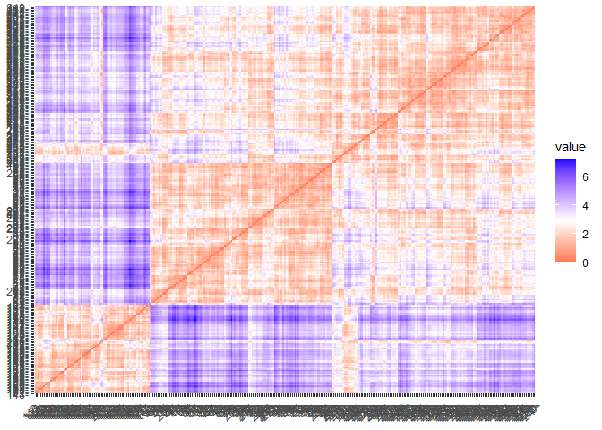
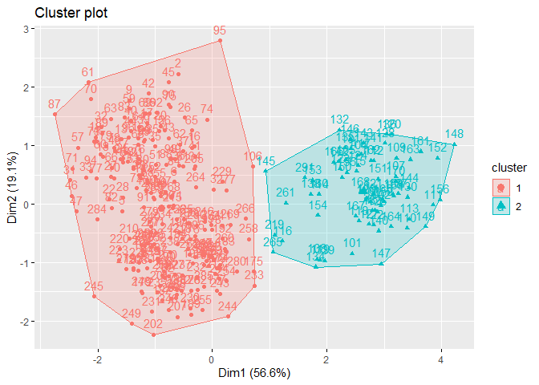
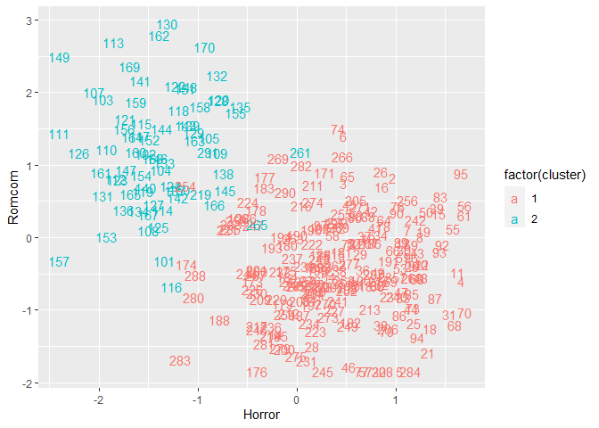
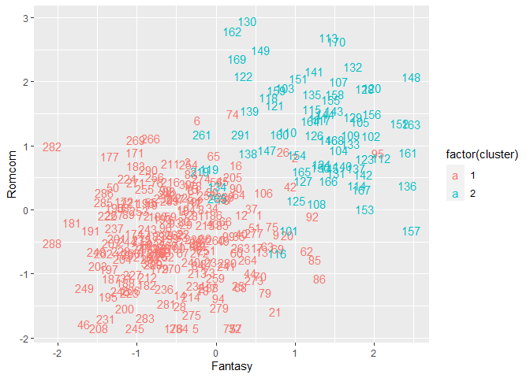
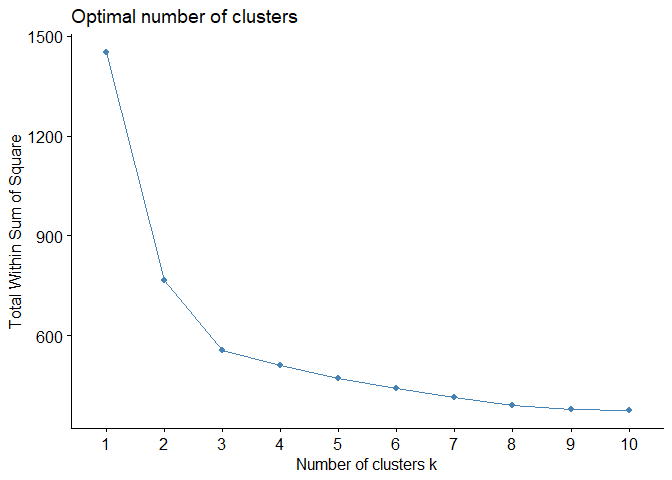

Machine Learning: Unsupervised Learning with R
================
Adiva Shabana, edited by Yurham Afif
6/13/2021

# K-means Clustering

Analysis by Yurham Afif

K-means Clustering is an algorithm that groups/cluster data according to
the wanted configuration, represented by a centroid which correspond to
the mean of points assigned to the clusters.

In this case, we will use dataset `customer_movie_rating.csv` to create
a customer segmentation using K-means clustering and determine the best
k value.

## Library

Assign the dependence library `tidyverse`, `gridExtra` and `tidyverse`

``` r
library(tidyverse)  # data manipulation and visualization
```

    ## Warning: package 'tidyverse' was built under R version 4.0.5

    ## -- Attaching packages --------------------------------------- tidyverse 1.3.1 --

    ## v ggplot2 3.3.3     v purrr   0.3.4
    ## v tibble  3.1.0     v dplyr   1.0.5
    ## v tidyr   1.1.3     v stringr 1.4.0
    ## v readr   1.4.0     v forcats 0.5.1

    ## Warning: package 'tidyr' was built under R version 4.0.5

    ## Warning: package 'readr' was built under R version 4.0.5

    ## Warning: package 'dplyr' was built under R version 4.0.5

    ## -- Conflicts ------------------------------------------ tidyverse_conflicts() --
    ## x dplyr::filter() masks stats::filter()
    ## x dplyr::lag()    masks stats::lag()

``` r
library(gridExtra)  # plot arrangement
```

    ## Warning: package 'gridExtra' was built under R version 4.0.5

    ## 
    ## Attaching package: 'gridExtra'

    ## The following object is masked from 'package:dplyr':
    ## 
    ##     combine

``` r
library(factoextra) # clustering algorithm and visualisation
```

    ## Warning: package 'factoextra' was built under R version 4.0.5

    ## Welcome! Want to learn more? See two factoextra-related books at https://goo.gl/ve3WBa

## Read data

This is the code chunk to load `customer_movie_rating.csv`

``` r
movie_rating <- read_csv('customer_movie_rating.csv')
```

    ## 
    ## -- Column specification --------------------------------------------------------
    ## cols(
    ##   Horror = col_double(),
    ##   Romcom = col_double(),
    ##   Action = col_double(),
    ##   Comedy = col_double(),
    ##   Fantasy = col_double()
    ## )

``` r
head(movie_rating)
```

    ## # A tibble: 6 x 5
    ##   Horror Romcom Action Comedy Fantasy
    ##    <dbl>  <dbl>  <dbl>  <dbl>   <dbl>
    ## 1   72.5   29.9   68.6   40.7    57.9
    ## 2   82.2   45.3   76.5   17.4    67.7
    ## 3   70     44     65.1   53.7    37.8
    ## 4   99.1   21     77.9   25.4    40.3
    ## 5   84      0     68.1   49.8    40  
    ## 6   70.2   55     97.2   48.1    40.5

## Data Preparation

check any missing values and standardise the data

``` r
movie_rating %>% is.na() %>% sum()
```

    ## [1] 0

``` r
rating <- movie_rating %>% scale()
head(rating)
```

    ##         Horror     Romcom      Action     Comedy    Fantasy
    ## [1,] 0.5716500 -0.0791958 -0.01515773 -0.6986964  0.5587483
    ## [2,] 0.9696365  0.8275698  0.48122544 -1.7277543  1.0042660
    ## [3,] 0.4690762  0.7510247 -0.23507432 -0.1245439 -0.3550175
    ## [4,] 1.6630357 -0.6032357  0.56919208 -1.3744297 -0.2413650
    ## [5,] 1.0434897 -1.8397343 -0.04657438 -0.2967896 -0.2550033
    ## [6,] 0.4772821  1.3987144  1.78187502 -0.3718711 -0.2322728

``` r
distance <- get_dist(rating)
fviz_dist(distance)
```

<!-- -->

## Computing K-Means

Set the centroid = 2 as we want to group the data into 2 clusters.

``` r
k2 <- kmeans(rating, centers = 2, nstart = 25)
str(k2)
```

    ## List of 9
    ##  $ cluster     : int [1:291] 1 1 1 1 1 1 1 1 1 1 ...
    ##  $ centers     : num [1:2, 1:5] 0.463 -1.383 -0.402 1.2 0.392 ...
    ##   ..- attr(*, "dimnames")=List of 2
    ##   .. ..$ : chr [1:2] "1" "2"
    ##   .. ..$ : chr [1:5] "Horror" "Romcom" "Action" "Comedy" ...
    ##  $ totss       : num 1450
    ##  $ withinss    : num [1:2] 606 160
    ##  $ tot.withinss: num 765
    ##  $ betweenss   : num 685
    ##  $ size        : int [1:2] 218 73
    ##  $ iter        : int 1
    ##  $ ifault      : int 0
    ##  - attr(*, "class")= chr "kmeans"

``` r
fviz_cluster(k2, data = rating)
```

<!-- -->

What does theis 2 clusters tells us about? Let’s try to figure it out by
visualise cluster result for each features.

``` r
rating %>%
  as_tibble() %>%
  mutate(cluster = k2$cluster, # add clustered data into tibble `rating`
        customer = 1:291 ) %>%
  ggplot(aes(Horror, Romcom, color = factor(cluster), label = customer)) +
  geom_text()
```

<!-- -->

Cluster 2 rates romance higher than horror, compared to cluster 1 that
rates horror higher than romance

``` r
rating %>%
  as_tibble() %>%
  mutate(cluster = k2$cluster, # add clustered data into tibble `rating`
        customer = 1:291 ) %>%
  ggplot(aes(Fantasy, Romcom, color = factor(cluster), label = customer)) +
  geom_text()
```

<!-- -->

cluster 1 rates romance and fantasy lower than cluster 2 do

## Determining Optimal Clusters

there are three optimal cluster number determination method,
i.e. `Elbow Method`, `Average Silhouette Method`, and
`Gap Statistics Method`. In this case, we will use `Elbow Method`. The
idea is to choose the number which has the most significant difference
for the data and not over differentiate it.

``` r
set.seed(123)
fviz_nbclust(rating, kmeans, method = "wss")
```

<!-- -->

``` r
#fviz_nbclust(rating, kmeans, method = "silhouette")
```

From the graph above, we choose k = 3 as our number of clusters

``` r
set.seed(123)
final <- kmeans(rating, 3, nstart = 25)
print(final)
```

    ## K-means clustering with 3 clusters of sizes 114, 72, 105
    ## 
    ## Cluster means:
    ##        Horror     Romcom     Action     Comedy     Fantasy
    ## 1  0.04409655 -0.4249402  0.3456929  0.5053192 -0.78478335
    ## 2 -1.39161333  1.2100503 -1.1767013  0.8158762  1.29578460
    ## 3  0.90637289 -0.3683851  0.4315572 -1.1080902 -0.03648752
    ## 
    ## Clustering vector:
    ##   [1] 3 3 1 3 3 3 3 3 3 3 3 3 3 3 3 3 3 3 3 3 3 3 3 3 3 3 3 3 3 3 3 3 3 3 3 3 3
    ##  [38] 3 3 3 3 3 3 3 3 3 3 3 3 1 3 3 3 3 3 3 3 3 3 3 3 3 3 3 3 3 3 3 3 3 3 3 3 3
    ##  [75] 3 3 3 3 3 3 3 3 3 3 3 3 3 3 3 3 3 3 3 3 3 3 3 3 3 3 2 2 2 2 2 2 2 2 2 2 2
    ## [112] 2 2 2 2 2 2 2 2 2 2 2 2 2 2 2 2 2 2 2 2 2 2 2 2 2 2 2 2 2 2 2 2 2 2 2 2 2
    ## [149] 2 2 2 2 2 2 2 2 2 2 2 2 2 2 2 2 2 2 2 2 2 2 1 1 1 1 1 1 1 1 1 1 1 1 1 1 1
    ## [186] 1 1 1 1 1 1 1 1 1 1 1 1 1 1 1 1 1 1 1 3 1 1 1 1 1 1 1 1 1 1 1 1 1 1 1 1 1
    ## [223] 1 1 1 1 1 1 1 1 1 1 1 1 1 1 1 1 1 1 3 1 1 1 1 1 1 1 1 1 1 1 1 1 1 1 1 1 1
    ## [260] 1 2 1 3 3 1 1 1 3 1 1 1 1 1 1 1 1 1 1 1 1 1 1 1 3 1 1 1 1 3 1 2
    ## 
    ## Within cluster sum of squares by cluster:
    ## [1] 205.8360 156.4432 191.4703
    ##  (between_SS / total_SS =  61.8 %)
    ## 
    ## Available components:
    ## 
    ## [1] "cluster"      "centers"      "totss"        "withinss"     "tot.withinss"
    ## [6] "betweenss"    "size"         "iter"         "ifault"

``` r
movie_rating %>%
  mutate(Cluster = final$cluster) %>%
  group_by(Cluster) %>%
  summarise_all("mean")
```

    ## # A tibble: 3 x 6
    ##   Cluster Horror Romcom Action Comedy Fantasy
    ##     <int>  <dbl>  <dbl>  <dbl>  <dbl>   <dbl>
    ## 1       1   59.6   24.0   74.3   68.0    28.3
    ## 2       2   24.6   51.8   50.1   75.0    74.1
    ## 3       3   80.7   25.0   75.7   31.4    44.8

Interpretation: - Cluster 1 : cluster that gives `horror` low rate -
Cluster 3 : Cluster that gives `romcom` and `fantacy` low rate - Cluster
2 : Cluster that gives `horror` and `action` high rate
